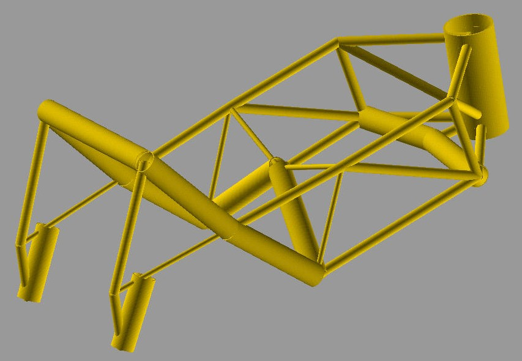

.. _example_mapdl_motorbike_frame:

MAPDL motorbike frame: Project creation
=======================================

This example shows how to create from scratch a REP project consisting of an Ansys APDL beam model
of a tubular steel trellis motorbike frame. After creating the project's job definition, 10 design
points with randomly chosen parameter values are created and set to pending.

The model is parametrized as follows:

- Three custom tube types are defined whose radius and thickness can vary in a certain range.
- For each tube in the frame, there is a string parameter specifying which custom type it should be made of.
- Output parameters of interest are the weight, torsion stiffness, and maximum von Mises stress for a breaking load case. 

For more information about this finite element model and its parametrization, see
"Using Evolutionary Methods with a Heterogeneous Genotype Representation 
for Design Optimization of a Tubular Steel Trellis Motorbike-Frame", 2003
by U. M. Fasel, O. Koenig, M. Wintermantel and P. Ermanni.

.. only:: builder_html

     You can download the :download:`ZIP file <../../../build/mapdl_motorbike_frame.zip>` for the MAPDL motorbike frame example
     and use a tool such as 7Zip to extract the files.

Here is the ``project_setup.py`` script for this example:
 
.. literalinclude:: ../../../examples/mapdl_motorbike_frame/project_setup.py
    :language: python
    :caption: project_setup.py
